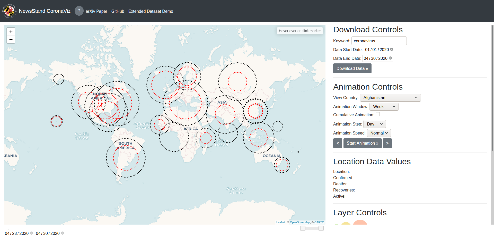

# NewsStand CoronaViz

NewsStand CoronaViz is a research prototype that enables the dynamic map
visualization of COVID-19 related variables including the number of
infections, active cases, recoveries, and deaths all on a daily basis
from the Johns Hopkins University web site at
<https://coronavirus.jhu.edu/map.html>, as well as mentions in news
articles and tweets as they occur, by allowing the underlying spatial
region and the spanned time interval to vary. Any combination of the
variables can be viewed subject to a possibility of clutter which is
avoided by the use of concentric circles (termed geo-circles whose radii
correspond to ranges of variable values. The variable values are
provided both on cumulative and day-by-day bases. The visualization
enables spatial, temporal, and keyword variation (i.e., it can be used
for names of other disease names or entirely other concepts such as
names of brands, people, etc. with an appropriate set of variables and
document collections).

NewsStand CoronaViz is being developed at the University of Maryland at
College Park under the leadership of Prof. Hanan Samet
<https://www.cs.umd.edu/~hjs> with Mr. John Kastner and Mr. Hong Wei. It
was motivated by the continuing spread of COVID-19 which led to the
desire to track its progress over time to be better prepared to
anticipate its emergence in new regions. There exist numerous systems to
monitor and map officially released numbers of cases \[1\] which are the
current established means of keeping track of the progress of the virus.
However, these systems do not necessarily paint a complete picture. For
example, they are primarily mashups in that they do not support zooming
in on the map in the sense that they just increase the resolution of the
map but do not show the data for the additional units (e.g.,
states/provinces, counties, etc.) that have become visible as a result
of the zoom.

NewsStand CoronaViz is designed to fill in gaps in the official reports
thereby providing a more complete picture. It incorporates the NewsStand
system \[2,4\] <http://newsstand.umiacs.umd.edu> (see also the related
TwitterStand system \[3\] <http://twitterstand.umiacs.umd.edu>) which
are example applications of a general framework being developed at the
University of Maryland at College Park under the direction of Prof.
Hanan Samet with his associates to enable searching for information
using a map query interface. When the information domain is news, the
underlying search domain results from monitoring the output of over
10,000 RSS news sources and is available for retrieval within minutes of
publication. The advantage of doing so is that a map, coupled with the
ability to vary the zoom level at which it is viewed, provides an
inherent granularity to the search process that facilitates an
approximate search.

NewsStand CoronaViz makes use of NewsStand to find all news articles and
tweets (identified by containing a pointer to a URL of an RSS feed) that
contain the keyword (COVID-19 or Coronavirus in our case). It also
identifies each toponym (geographic location) that is mentioned in the
article or tweet. Next, it takes the cross product of these sets as the
set of geocoded keywords. In other words, a pair associating every
keyword in the article or tweet with every location mentioned in the
article or tweet. Each of the keyword location pairs is also associated
with the time of publication of the article in order to enable the
temporal component of NewsStand CoronaViz. The result is the ability to
explore the spread of the disease through analysis of keyword prevalence
in geotagged news article and tweets over spatial and temporal ranges.

##### References:

1.  E. Dong, H. Du, and L. Gardner. An interactive web-based dashboard
    to track COVID-19 in real time. The Lancet Infectious Diseases,
    2020.
2.  H. Samet, J. Sankaranarayanan, M. D. Lieberman, M. D. Adelfio, B. C.
    Fruin, J. M. Lotkowski, D. Panozzo, J. Sperling, B. E. Teitler.
    Reading news with maps by exploiting spatial synonyms.
    Communications of the ACM, 57(10):64-77, October 2014. Cover article
    of the October CACM issue. Video specially made by ACM at
    <http://vimeo.com/106352925>
3.  J. Sankaranarayanan, H. Samet, B. Teitler, M. D. Lieberman, J.
    Sperling. TwitterStand: News in tweets. Proceedings of the 17th ACM
    SIGSPATIAL International Conference on Advances in Geographic
    Information Systems, pages 42-51, Seattle, WA, November 2009.
4.  B. Teitler, M. D. Lieberman, D. Panozzo, J. Sankaranarayanan, H.
    Samet, J. Sperling. NewsStand: A new view on news. Proceedings of
    the 16th ACM SIGSPATIAL International Conference on Advances in
    Geographic Information Systems, pages 144-153, Irvine, CA, November
    2008. (2008 ACM SIGSPATIAL (ACMGIS08) Best Paper Award and 2018
    SIGSPATIAL 10 Year Impact Award).

-----

\* This work was sponsored in part by the National Science Foundation under Grant IIS-1816889.
